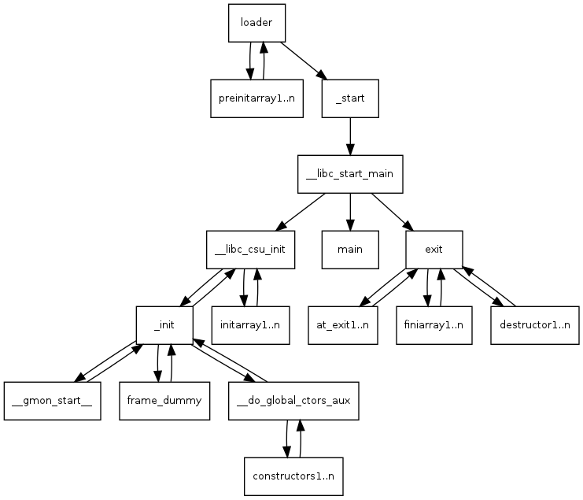

```c
这篇文章主要面向对象是为了那些想深入了解linux下程序的加载过程的读者，它主要介绍了X86 ELF文件的动态加载过程。这篇文章将会使你理解如何debug main函数启动前发生的问题。本文基于事实描述，但是将会忽略一些与上述主题无关的细节。如果你是静态编译的，一些细节将会与本文的描述不符，这篇文章并不会列举出这些差异。当你读完这篇文章，你将会对X86的main函数启动前后非常了解。
```


- [调用过程分析](#调用过程分析)
  - [main函数的调用](#main函数的调用)
  - [_start函数分析](#_start函数分析)
    - [首先_start是如何启动的?](#首先_start是如何启动的?)
    - [_start函数就是我们开始的地方](#_start函数就是我们开始的地方)
    - [调用__libc_start_main之前的设置](#调用__libc_start_main之前的设置)
    - [环境变量哪里去了?](#环境变量哪里去了?)
  - [__libc_start_main函数分析](#__libc_start_main函数分析)
    - [__libc_start_main功能概述](#__libc_start_main功能概述)
    - [调用init参数](#调用init参数)
  - [__libc_csu_init函数分析](#__libc_csu_init函数分析)
    - [用户应用程序的构造函数](#用户应用程序的构造函数)
    - [这个函数到底是干什么的?](#这个函数到底是干什么的?)
    - [但是__libc_csu_init里的循环是干什么的?](#但是__libc_csu_init里的循环是干什么的?)
  - [_init函数分析](#_init函数分析)
    - [init函数的调用](#init函数的调用)
    - [_init函数起始于常规的C函数调用](#_init函数起始于常规的C函数调用)
  - [gmon_start函数分析](#gmon_start函数分析)
  - [frame_dummy函数分析](#frame_dummy函数分析)
  - [__do_global_ctors_aux函数分析](#__do_global_ctors_aux函数分析)
    - [终于到构造函数了!](#终于到构造函数了!)
    - [来看个例子](#来看个例子)
    - [prog2的_init函数,像极了prog1的](#prog2的_init函数,像极了prog1的)
    - [这是将要调用的函数的源代码](#这是将要调用的函数的源代码)
    - [汇编语言也是这样](#汇编语言也是这样)
      - [函数开始的部分](#函数开始的部分)
      - [循环之前的设置](#循环之前的设置)
      - [此时执行到了loop的顶端](#此时执行到了loop的顶端)
      - [函数谢幕](#函数谢幕)
    - [承诺过你的使用debugger进入prog2](#承诺过你的使用debugger进入prog2)
  - [回到__libc_csu_init__](#回到__libc_csu_init__)
  - [这是另一个函数的循环调用](#这是另一个函数的循环调用)
  - [程序将返回__libc_start_main](#程序将返回__libc_start_main)
- [这个程序,把上面所有的过程联系了起来](#这个程序,把上面所有的过程联系了起来)


## 调用过程分析

### main函数的调用

我们将编译一个最简单的C程序,   空的`main`函数，然后，查看其反汇编代码以理解程序是如何从启动开始调用到main函数。从反汇编代码中，我们发现程序是由一个`_start`函数最终调用`main`函数执行的。

```c
int main()
{
}
```


**将上述代码保存为prog1.c，首先要做的是使用下面的命令编译这个文件：**

```bash
gcc -ggdb -o prog1 prog1.c
```

我们首先查看其反汇编代码，通过这个程序来查看关于程序启动的一些过程，然后再用GDB去调试比这个版本稍微复杂一点的程序`prog2`。下面将会列举 ==**`objdump -d prog1`**== 的输出，但是并不会按照该命令原本的顺序列举，而是会按照输出内容执行的顺序来输出（你可以自己dump这个结果，比如使用命令 ==**`objdump -d prog1 > prog1.dump`**== ，就能保存objdump的输出，然后使用你熟悉的编辑器打开并查看它）。（但是RPUVI——一个真正的程序员是使用VI的）。


### _start函数分析

#### 首先_start是如何启动的?

当你执行一个程序的时候，shell或者GUI会调用execve()，它会执行linux系统调用execve()。如果你想了解关于execve()函数，你可以简单的在shell中输入 ==**`man execve`**== 。这些帮助来自于man手册（包含了所有系统调用）的第二节。简而言之，系统会为你设置栈，并且将==`argc`，`argv`和`envp`压入栈中== 。文件描述符0，1和2（stdin, stdout和stderr）保留shell之前的设置。加载器会帮你完成重定位，调用你设置的预初始化函数。当所有搞定之后，控制权会传递给==**`_start()`**==，下面是使用 ==`objdump -d prog1`==输出的_start函数的内容：

```assembly
080482e0 <_start>:
80482e0:       31 ed                   xor    %ebp,%ebp
80482e2:       5e                      pop    %esi              #  argc  -> rsi
80482e3:       89 e1                   mov    %esp,%ecx         #  argv  -> ecx
80482e5:       83 e4 f0                and    $0xfffffff0,%esp    #清除栈指针后四位
80482e8:       50                      push   %eax      #__libc_start_main  函数的参数压入栈中
80482e9:       54                      push   %esp
80482ea:       52                      push   %edx
80482eb:       68 00 84 04 08          push   $0x8048400
80482f0:       68 a0 83 04 08          push   $0x80483a0
80482f5:       51                      push   %ecx
80482f6:       56                      push   %esi
80482f7:       68 94 83 04 08          push   $0x8048394
80482fc:       e8 c3 ff ff ff          call   80482c4 <__libc_start_main@plt>
8048301:       f4


# 下面是另一个 x86_64版本  - debian, 5.10.25-linuxkit
Disassembly of section .text:

0000000000001040 <_start>:
    1040:   31 ed                   xor    %ebp,%ebp
    1042:   49 89 d1                mov    %rdx,%r9
    1045:   5e                      pop    %rsi
    1046:   48 89 e2                mov    %rsp,%rdx
    1049:   48 83 e4 f0             and    $0xfffffffffffffff0,%rsp
    104d:   50                      push   %rax
    104e:   54                      push   %rsp
    104f:   4c 8d 05 3a 01 00 00    lea    0x13a(%rip),%r8        # 1190 <__libc_csu_fini>
    1056:   48 8d 0d d3 00 00 00    lea    0xd3(%rip),%rcx        # 1130 <__libc_csu_init>
    105d:   48 8d 3d c1 00 00 00    lea    0xc1(%rip),%rdi        # 1125 <main>
    1064:   ff 15 76 2f 00 00       callq  *0x2f76(%rip)        # 3fe0 <__libc_start_main@GLIBC_2.2.5>
    106a:   f4                      hlt
    106b:   0f 1f 44 00 00          nopl   0x0(%rax,%rax,1)
```


#### _start函数就是我们开始的地方

1. **任何值`xor`自身得到的结果都是0。所以`xor %ebp,%ebp`语句会把`%ebp`设置为0**
   1. ABI（Application Binary Interface specification）推荐这么做，目的是为了标记最外层函数的页帧（frame）
2. **接下来，从栈中弹出栈顶的值保存到`%esi`**
   1. 在最开始的时候我们把`argc`，`argv`和`envp`放到了栈里，所以现在的`pop`语句会把`argc`放到`%esi`中。这里只是临时保存一下，稍后我们会把它再次压回栈中。
3. 因为我们弹出了`argc`，所以`%ebp`现在指向的是`argv`。`mov`指令把`argv`放到了`%ecx`中，但是并没有移动栈指针
4. **然后，将栈指针和一个可以清除后四位的掩码做`and`操作**
   1. 根据当前栈指针的位置不同，栈指针将会向下移动0到15个字节。这么做，保证了任何情况下，栈指针都是16字节的偶数倍对齐的。对齐的目的是保证栈上所有的变量都能够被内存和cache快速的访问。
      1. 要求这么做的是SSE，就是指令都能在单精度浮点数组上工作的那个（扩展指令集）。
         1. 比如，某次运行时，`_start`函数刚被调用的时候，`%esp`处于`0xbffff770`。在我们从栈上弹出`argc`后，`%esp`指向`0xbffff774`。它向高地址移动了（往栈里存放数据，栈指针地址向下增长；从栈中取出数据，栈指针地址向上增长）。当对栈指针执行了`and`操作后，栈指针回到了`0xbffff770`。


#### 调用__libc_start_main之前的设置

5. ==**现在，我们把`__libc_start_main`函数的参数压入栈中 `push   %eax`**==
   1. 第一个参数`%eax`被压入栈中，里面保存了无效信息，原因是稍后会有七个参数将被压入栈中，但是为了保证16字节对齐，所以需要第八个参数。这个值也并不会被用到。
      1. `__libc_start_main`是在链接的时候从glibc复制过来的。在glibc的代码中，它位于`csu/libc-start.c`文件里。`__libc_start_main`的定义如下：

```c
int __libc_start_main(  int (*main) (int, char * *, char * *),
                int argc, char * * ubp_av,
                void (*init) (void),
                void (*fini) (void),
                void (*rtld_fini) (void),
                void (* stack_end));
```

**所以，我们期望`_start`函数能够将`__libc_start_main`需要的参数按照逆序压入栈中**

调用__libc_start_main函数前，栈的内容


**__libc_csu_fini函数也是从glibc被链接进我们代码的，它的源代码位于csu/elf-init.c中。稍后我们会看到它。**


#### 环境变量哪里去了?

你是否注意到我们并没有获取envp（栈里指向我们环境变量的指针）？它并不是==**`__libc_start_main`**== 函数的参数。但是我们知道main函数的原型其实是 ==**`int main(int argc, char** argv, char** envp)`**== 。所以，到底怎么回事？

```c
void __libc_init_first(int argc, char *arg0, ...)
{
    char **argv = &arg0, **envp = &argv[argc + 1];
    __environ = envp;
    __libc_init (argc, argv, envp);
}
```

其实， **`__libc_start_main`** 函数会调用 **`__libc_init_first`**，这个函数会使用内部信息去找到环境变量（实际上环境变量就位于`argv`的终止字符null的后面），然后设置一个全局变量 **`__environ`** ，这个全局变量可以被**`__libc_start_main`** 函数内部任何地方使用，包括调用main函数时。当 **`envp`** 建立了之后，**`__libc_start_main`** 函数会使用相同的小技巧，越过envp数组之后的 **`NULL`** 字符，获取另一个向量——ELF辅助向量（加载器使用它给进程传递一些信息）。通过一个简单的方法可以查看里面的内容：运行程序前，设置环境变量**`LD_SHOW_AUXV=1`**。

下面这是对于prog1运行的结果。

```bash
$ LD_SHOW_AUXV=1 ./prog1
# 输出
AT_SYSINFO:      0xe62414
AT_SYSINFO_EHDR: 0xe62000
AT_HWCAP:    fpu vme de pse tsc msr pae mce cx8 apic
             mtrr pge mca cmov pat pse36 clflush dts
             acpi mmx fxsr sse sse2 ss ht tm pbe
AT_PAGESZ:       4096
AT_CLKTCK:       100             #times()的频率是100
AT_PHDR:         0x8048034       #是ELF program header 的位置,它包括了程序中所有segment在内存中的位置信息，重定位条目和加载器需要的一些信息
AT_PHENT:        32              # header entry 标题条目的字节数
AT_PHNUM:        8      
AT_BASE:         0x686000
AT_FLAGS:        0x0
AT_ENTRY:        0x80482e0
AT_UID:          1002          #UID
AT_EUID:         1002          #有效UID
AT_GID:          1000          #GID
AT_EGID:         1000          #有效GID
AT_SECURE:       0
AT_RANDOM:       0xbff09acb
AT_EXECFN:       ./prog1
AT_PLATFORM:     i686         #电脑是i686，


# 下面是另一个 x86_64版本  - debian, 5.10.25-linuxkit
root@cd2f7c851a1d:~# LD_SHOW_AUXV=1 ./prog1 
AT_SYSINFO_EHDR: 0x7ffd83990000
AT_HWCAP:        9f8bfbff
AT_PAGESZ:       4096
AT_CLKTCK:       100
AT_PHDR:         0x559638281040
AT_PHENT:        56
AT_PHNUM:        11
AT_BASE:         0x7f6a438c5000
AT_FLAGS:        0x0
AT_ENTRY:        0x559638281040
AT_UID:          0
AT_EUID:         0
AT_GID:          0
AT_EGID:         0
AT_SECURE:       0
AT_RANDOM:       0x7ffd838ef199
AT_HWCAP2:       0x2
AT_EXECFN:       ./prog1
AT_PLATFORM:     x86_64
```

有趣吧？各种各样的信息。==**`AT_ENTRY`是`_start`的地址**== ，还有我们的UID、有效UID和GID。而且，可以看出来我们的电脑是i686，times()的频率是100（每秒的clock-ticks数？稍后我调查一下）。==**`AT_PHDR`**== 是ELF program header 的位置，它包括了程序中所有segment在内存中的位置信息，重定位条目和加载器需要的一些信息。==**`AT_PHENT`**== 是header entry的字节数。接下来我们就不再顺着这个思路研究下去了，因为我们并不需要这些信息。


### __libc_start_main函数分析

#### __libc_start_main功能概述

稍后本文会详细介绍__libc_start_main函数，但是，它的主要功能如下:

1. 处理关于setuid、setgid程序的安全问题
2. 启动线程
3. 把 ==**`fini`**== 函数和 ==**`rtld_fini`**== 函数作为参数传递给==**`at_exit`**== 调用，使它们在==**`at_exit`**== 里被调用，从而完成用户程序和加载器的调用结束之后的清理工作
4. 调用其`init`参数
5. 调用`main`函数，并把`argc`和`argv`参数、环境变量传递给它
6. 调用`exit`函数，并将main函数的返回值传递给它


#### 调用init参数

`__libc_start_main`函数的`init`参数被设置成了`__libc_csu_init`函数，它也是被链接进我们代码的。它来源于glibc源代码中的csu/elf-init.c。其C代码如下（原代码只不过多了一些#ifdef）

```c
void
__libc_csu_init (int argc, char **argv, char **envp)
{

  _init ();

  const size_t size = __init_array_end - __init_array_start;
  for (size_t i = 0; i < size; i++)
      (*__init_array_start [i]) (argc, argv, envp);
}
```


### __libc_csu_init函数分析

#### 用户应用程序的构造函数

`__libc_csu_init`函数相当重要，因为它是我们可执行程序的构造函数。“等等！，我们的程序不是C++程序啊！”。是的，不是C++程序，但是构造函数和析构函数的概念并非属于C++，因为它的诞生早于C++。对于任意的可执行程序都可以有一个C函数的构造函数`__libc_csu_init`和C函数的析构函数`__libc_csu_fini`。在构造函数内部，你将会看到，可执行程序会找到全局C函数组成的构造函数集，并且调用它们。任何一个C程序都是可以有构造函数集的。稍后，我会展示一下。如果你觉得别扭，你可以将它们称为`Initializers`和`Finalizers`。下面是`__libc_csu_init`函数的反汇编代码：

```assembly
080483a0 <__libc_csu_init>:
 80483a0:       55                      push   %ebp
 80483a1:       89 e5                   mov    %esp,%ebp
 80483a3:       57                      push   %edi
 80483a4:       56                      push   %esi
 80483a5:       53                      push   %ebx
 80483a6:       e8 5a 00 00 00          call   8048405 <__i686.get_pc_thunk.bx>
 80483ab:       81 c3 49 1c 00 00       add    $0x1c49,%ebx
 80483b1:       83 ec 1c                sub    $0x1c,%esp
 80483b4:       e8 bb fe ff ff          call   8048274 <_init>
 80483b9:       8d bb 20 ff ff ff       lea    -0xe0(%ebx),%edi
 80483bf:       8d 83 20 ff ff ff       lea    -0xe0(%ebx),%eax
 80483c5:       29 c7                   sub    %eax,%edi
 80483c7:       c1 ff 02                sar    $0x2,%edi
 80483ca:       85 ff                   test   %edi,%edi
 80483cc:       74 24                   je     80483f2 <__libc_csu_init+0x52>
 80483ce:       31 f6                   xor    %esi,%esi
 80483d0:       8b 45 10                mov    0x10(%ebp),%eax
 80483d3:       89 44 24 08             mov    %eax,0x8(%esp)
 80483d7:       8b 45 0c                mov    0xc(%ebp),%eax
 80483da:       89 44 24 04             mov    %eax,0x4(%esp)
 80483de:       8b 45 08                mov    0x8(%ebp),%eax
 80483e1:       89 04 24                mov    %eax,(%esp)
 80483e4:       ff 94 b3 20 ff ff ff    call   *-0xe0(%ebx,%esi,4)
 80483eb:       83 c6 01                add    $0x1,%esi
 80483ee:       39 fe                   cmp    %edi,%esi
 80483f0:       72 de                   jb     80483d0 <__libc_csu_init+0x30>
 80483f2:       83 c4 1c                add    $0x1c,%esp
 80483f5:       5b                      pop    %ebx
 80483f6:       5e                      pop    %esi
 80483f7:       5f                      pop    %edi
 80483f8:       5d                      pop    %ebp
 80483f9:       c3                      ret       # __libc_csu_init 回到了这里


# 下面是另一个 x86_64版本  - debian, 5.10.25-linuxkit
0000000000001130 <__libc_csu_init>:
    1130:   41 57                   push   %r15
    1132:   49 89 d7                mov    %rdx,%r15
    1135:   41 56                   push   %r14
    1137:   49 89 f6                mov    %rsi,%r14
    113a:   41 55                   push   %r13
    113c:   41 89 fd                mov    %edi,%r13d
    113f:   41 54                   push   %r12
    1141:   4c 8d 25 d0 2c 00 00    lea    0x2cd0(%rip),%r12        # 3e18 <__frame_dummy_init_array_entry>
    1148:   55                      push   %rbp
    1149:   48 8d 2d d0 2c 00 00    lea    0x2cd0(%rip),%rbp        # 3e20 <__init_array_end>
    1150:   53                      push   %rbx
    1151:   4c 29 e5                sub    %r12,%rbp
    1154:   48 83 ec 08             sub    $0x8,%rsp
    1158:   e8 a3 fe ff ff          callq  1000 <_init>
    115d:   48 c1 fd 03             sar    $0x3,%rbp
    1161:   74 1b                   je     117e <__libc_csu_init+0x4e>
    1163:   31 db                   xor    %ebx,%ebx
    1165:   0f 1f 00                nopl   (%rax)
    1168:   4c 89 fa                mov    %r15,%rdx
    116b:   4c 89 f6                mov    %r14,%rsi
    116e:   44 89 ef                mov    %r13d,%edi
    1171:   41 ff 14 dc             callq  *(%r12,%rbx,8)
    1175:   48 83 c3 01             add    $0x1,%rbx
    1179:   48 39 dd                cmp    %rbx,%rbp
    117c:   75 ea                   jne    1168 <__libc_csu_init+0x38>
    117e:   48 83 c4 08             add    $0x8,%rsp
    1182:   5b                      pop    %rbx
    1183:   5d                      pop    %rbp
    1184:   41 5c                   pop    %r12
    1186:   41 5d                   pop    %r13
    1188:   41 5e                   pop    %r14
    118a:   41 5f                   pop    %r15
    118c:   c3                      retq
    118d:   0f 1f 00                nopl   (%rax)
```


#### 这个函数到底是干什么的?

再这我们先不多说了，但是我觉得你还挺想知道的。`get_pc_thunk`函数有点有趣。它是给位置无关码使用的。设置它们可以让位置无关代码正常工作。为了让它们工作，基址寄存器（%ebp）需要知道`GLOBAL_OFFSET_TABLE`。其部分代码如下：

```assembly
push %ebx
call __get_pc_thunk_bx
add  $_GLOBAL_OFFSET_TABLE_,%ebx   #偏移量 加 add指令基址
```

```assembly
__get_pc_thunk_bx:
movel (%esp),%ebx
return
```

好，我们仔细看看发生了什么。调用`__get_pc_thunk_bx`时，像所有其他函数调用一样，将下一条指令的地址压入栈中。这样，当函数返回时，就会继续执行下条指令。这个地址就是我们需要的地址。所以，在`__get_pc_thunk_bx`中，我们将返回地址从栈中复制到`%ebx`中。当返回的时候，==**下条指令会把`_GLOBAL_OFFSET_TABLE_`加到`%ebx`上去，其中`_GLOBAL_OFFSET_TABLE_`代表了当前地址和位置无关码使用的`GOT(global offset table)`的差值**==。在`GOT`中保存了我们想访问的变量的指针的集合，并且我们只需要知道数据在这个表中的偏移量就行。加载器会为我们修改这个表里面的地址。对于函数来讲，也有一个类似的表（PLT）。汇编里面这么编写实在是太烦人了，但是，在C或者C++中，你可以将-pic参数传递给编译器，它将会自动帮你完成这个工作。如果有兴趣的话可以看看编译器的源码，你就知道编译器如何使用-pic这个标志去编译源码了

>*译者注：上述·**__get_pc_thunk_bx**·函数的主要目的其实是获取变量对应的GOT，以通过它获取变量真正的值。之所以这么写，是因为在32位系统里，没有类似于rip的寄存器，因此并不能直接获取当前指令的地址，而在64位系统里就不用这种小技巧了。详细请参考 **参考阅读[1]**.*


#### 但是__libc_csu_init里的循环是干什么的?

等我们讨论完init()（实际上调用的是_init）之后，我们将会讨论`__libc_csu_init`函数里的循环。现在我们只要记住：**它调用了用户程序中所有用C代码编写的`initializers`**. (初始值设定项)


### _init函数分析

#### init函数的调用

好的，当加载器将控制权交给`_start`函数之后，`_start`函数将会调用`__libc_start_main`函数，`__libc_start_main`函数会调用`__libc_csu_init`函数, `__libc_csu_init`函数会调用`_init`函数。

```assembly
08048274 <_init>:
 8048274:       55                      push   %ebp
 8048275:       89 e5                   mov    %esp,%ebp
 8048277:       53                      push   %ebx
 8048278:       83 ec 04                sub    $0x4,%esp
 804827b:       e8 00 00 00 00          call   8048280 <_init+0xc>
 8048280:       5b                      pop    %ebx
 8048281:       81 c3 74 1d 00 00       add    $0x1d74,%ebx        (.got.plt)
 8048287:       8b 93 fc ff ff ff       mov    -0x4(%ebx),%edx
 804828d:       85 d2                   test   %edx,%edx
 804828f:       74 05                   je     8048296 <_init+0x22>
 8048291:       e8 1e 00 00 00          call   80482b4 <__gmon_start__@plt>
 8048296:       e8 d5 00 00 00          call   8048370 <frame_dummy>
 804829b:       e8 70 01 00 00          call   8048410 <__do_global_ctors_aux>
 80482a0:       58                      pop    %eax
 80482a1:       5b                      pop    %ebx
 80482a2:       c9                      leave
 80482a3:       c3                      ret
```


#### _init函数起始于常规的C函数调用

如果你想了解C函数调用规范的话，请参考这篇博客[Basic Assembler Debugging with GDB](http://dbp-consulting.com/tutorials/debugging/basicAsmDebuggingGDB.html)。简单来讲就是，调用者的基址寄存器（%ebp）会被保存到栈里，当前函数的基址寄存器（%ebp）会指向栈顶，然后，保留4个字节空间。这里有趣的是第一次函数调用。它的作用和我们之前看到的之前调用`get_pc_trunk`非常像。如果你仔细看的话，发现调用的是下一条指令的地址！这就好像仅仅是顺序执行了而已，但是这么做的目的是，当前的地址被压入了栈中。然后通过弹出栈操作，又把它放到了`%ebx`中，之后就可以用它来设置访问全局访问表GOT了。


### gmon_start函数分析

##### 生成[profile](https://en.wikipedia.org/wiki/Profiling_(computer_programming))文件

然后，我们来看`gmon_start`函数。如果它是空的，我们跳过它，不调用它。否则，调用它来设置profiling。该函数调用一个例程开始profiling，并且调用`at_exit`去调用另一个程序运行,并且在运行结束的时候生成gmon.out。

> *译者注： 为了优化软件中频繁调用的部分，从而提高程序整体执行的效率，我们可以在使用gcc编译的时候加上* `-pg`*标志。这样在程序运行结束的时候会生成一个记录程序运行状态的文件叫做*`gmon.out`*。然后，我们可以使用一个名为*`gprof`*的GNU profiler工具来分析该文件从而获得程序各部分的运行时间，来反映其运行性能。详情请参考 **参考阅读[2]**.*


### frame_dummy函数分析

#### 函数并不是空的

完成上述两者之一的某个函数之后，接下来`frame_dummy`函数会被调用。其目的是调用`__register_frame_info`函数，但是，调用`frame_dummy`是为了给上述函数设置参数。这么做的目的是为了在出错时设置unwinding stack frames。这个非常有意思，但是并不是这次讨论的主题，所以以后有机会我们再讨论它。


### __do_global_ctors_aux函数分析

#### 终于到构造函数了!

终于调用到`__do_global_ctors_aux`函数了。如果在调用main函数之前，你的程序出了问题，你很可能需要看看这个函数。当然，这里存放了全局C++对象的构造函数，但是，这里也能存放其他东西。


#### 来看个例子

我们修改程序prog1，并把它叫做prog2。令人兴奋的部分是`__attribute__ ((constructor))`，它告诉GCC：链接器应该在`__do_global_ctors_aux`使用的表里创建一个指针指向这里。如你所见，我们编写的构造函数确实运行了（`__FUNCTION__`被编译器替换成了当前函数的名字，这就是GCC魅力所在）。

```C
#include <stdio.h>
// __attribute__ ((constructor))  告诉链接器应该在__do_global_ctors_aux使用的表里创建一个指针指向这里
// 在gcc中的  __do_global_ctors_aux 汇编函数调用 call
// __libc_csu_init
void __attribute__ ((constructor)) a_constructor() {  
    printf("%s\n", __FUNCTION__);      // 这个会在 main() 运行前进行输出
} 

int
main()
{
    printf("%s\n",__FUNCTION__);
}
```

```bash
$ gcc prog2.c -o prog2 -ggdb
$./prog2
# 输出
a_constructor
mai
```


#### prog2的_init函数,像极了prog1的

稍后我们将使用GDB看看到底发生了什么。我们将进入prog2的_init函数。

```assembly
08048290 <_init>:
 8048290:       55                      push   %ebp
 8048291:       89 e5                   mov    %esp,%ebp
 8048293:       53                      push   %ebx
 8048294:       83 ec 04                sub    $0x4,%esp
 8048297:       e8 00 00 00 00          call   804829c <_init+0xc>
 804829c:       5b                      pop    %ebx
 804829d:       81 c3 58 1d 00 00       add    $0x1d58,%ebx     #这一行变了
 80482a3:       8b 93 fc ff ff ff       mov    -0x4(%ebx),%edx
 80482a9:       85 d2                   test   %edx,%edx
 80482ab:       74 05                   je     80482b2 <_init+0x22>
 80482ad:       e8 1e 00 00 00          call   80482d0 <__gmon_start__@plt>
 80482b2:       e8 d9 00 00 00          call   8048390 <frame_dummy>
 80482b7:       e8 94 01 00 00          call   8048450 <__do_global_ctors_aux>
 80482bc:       58                      pop    %eax
 80482bd:       5b                      pop    %ebx
 80482be:       c9                      leave
 80482bf:       c3                      ret  # 到 80483f9 in __libc_csu_init 
 
 

# 下面是另一个 x86_64版本  - debian, 5.10.25-linuxkit
0000000000001000 <_init>:
    1000:   48 83 ec 08             sub    $0x8,%rsp
    1004:   48 8b 05 dd 2f 00 00    mov    0x2fdd(%rip),%rax        # 3fe8 <__gmon_start__>
    100b:   48 85 c0                test   %rax,%rax
    100e:   74 02                   je     1012 <_init+0x12>
    1010:   ff d0                   callq  *%rax
    1012:   48 83 c4 08             add    $0x8,%rsp
    1016:   c3                      retq   
```

我们可以看到，上述的地址和prog1的地址略微有所不同。这些有差异的地址似乎相对于prog1移动了28个字节。这里，有两个函数：`"a_constructor"`（加上结束符一共14个字节）、`"main"`（加上结束符一共5个字节）和两个格式化字符串`"%s\n"`（2*4个字节，加上一个1字节的换行符和终止符），所以14 + 5 + 4 + 4 = 27？ 似乎还差一个。不管怎样，这只是个猜想，我就不仔细研究了。然后我们就要跳入到`__do_global_ctors_aux`函数中去，看看到底发生了什么。


#### 这是将要调用的函数的源代码

为了方便研究，我们列举出`__do_global_ctors_aux`函数的C代码，它位于GCC源码中的gcc/crtstuff.c里。

```c
__do_global_ctors_aux (void)
{
  func_ptr *p;
  for (p = __CTOR_END__ - 1; *p != (func_ptr) -1; p--)  // __CTOR_END__  静态 函数指针 数组[1]
    (*p) ();
}
```

如上所示，p的值被初始化成`__CTOR_END__`减去一个字节。这是一种指针算法，如果指针指向一个函数，在这种情况下，-1表示向上移动一个指针或者说4个字节。我们也能从汇编里面看出来。当指针不等于-1时，调用这个指针指向的函数，并且再次将指针上移。很明显，这个指针数组起始于-1，并且包含若干个函数指针。


## 汇编语言也是这样

下面是使用`objdump -d`得到的`__do_global_ctors_aux`函数对应的汇编语言。我们将仔细的查看它的每条指令，以便你就能够在我们使用debugger之前完全了解它。

```assembly
08048450 <__do_global_ctors_aux>:
 8048450:       55                      push   %ebp
 8048451:       89 e5                   mov    %esp,%ebp
 8048453:       53                      push   %ebx
 8048454:       83 ec 04                sub    $0x4,%esp
 8048457:       a1 14 9f 04 08          mov    0x8049f14,%eax   # 获得地址 0x8049f14 中的内容
 804845c:       83 f8 ff                cmp    $0xffffffff,%eax  # eax= 0x80483b4 <_init>
 804845f:       74 13                   je     0x8048474 <__do_global_ctors_aux+0x24>
 8048461:       bb 14 9f 04 08          mov    $0x8049f14,%ebx
 8048466:       66 90                   xchg   %ax,%ax   # 就是一个展位符,什么都不做,为了4字节对齐
 8048468:       83 eb 04                sub    $0x4,%ebx
 804846b:       ff d0                   call   *%eax     #调用了自己写的函数 a_constructor()
 804846d:       8b 03                   mov    (%ebx),%eax
 804846f:       83 f8 ff                cmp    $0xffffffff,%eax
 8048472:       75 f4                   jne    8048468 <__do_global_ctors_aux+0x18>
 8048474:       83 c4 04                add    $0x4,%esp
 8048477:       5b                      pop    %ebx
 8048478:       5d                      pop    %ebp
 8048479:       c3                      ret    # 到 0x08048290 <_init>:
```


#### 函数开始的部分

函数最开始的部分依然遵从了C函数正常的调用惯例（保存调用者的栈基址寄存器，设置当前函数的栈基址寄存器），本函数中还增加了一点：额外把`%ebx`保存到了栈中，因为这个函数后面会使用到它。同时，我们也为（C代码中的）指针p保留了空间。你可能注意到了，即使我们在栈上为其开辟了空间，但是从未使用这部分空间。取而代之的是，`p`将会保存到`%ebx`中，`*p`会保存到`%eax`中。


#### 循环之前的设置

看起来编译器做了一些优化，编译器并没有直接“加载`__CTOR_END__`，然后将其值减去1，再查找它指向的内容”，而是直接加载`*(__CTOR_END__ - 1)`，这是一个立即数`0x8049f14` ==（注意，`$0x8049f14`意思是一个立即数，而不带`$`，只写`0x8049f14`的意思是这个地址指向的内容）==。这个数里面的内容被直接放到了%eax中，然后立刻比较%eax和-1，如果相等，则跳转到地址0x8048474，回收栈，弹出我们保存在栈里的内容，函数调用结束，返回。

假设在函数表中至少有一个值，立即数`0x8049f14`被存放到`%ebx`，也就是函数指针`p`，然后执行指令`xchg %ax,%ax`，这是什么鬼？原来这是X86 16或者32位里的一个nop（No Operation）语句。它什么也不做，只是占据了一个指令周期，起一个占位符作用而已。在这种情况下，使循环开始于`8048468`，而不是`8048466`。这么做的好处是使循环开始的地方以4字节对齐，这样整个循环将会极大可能的被保存到一个cache line里，而不会被分成两段，从而起到加速执行的作用。


#### 此时执行到了loop的顶端

接下来，将`%ebx`减去4，从而为下一次循环做好准备，调用`%eax`里保存的地址对应的函数，然后将下一个函数指针移至`%eax`中，并且和-1比较，如果不等于-1，再次调回到上述循环。


#### 函数谢幕

此时，已经运行到函数的最后，然后返回到`_init`中，然后又运行到`_init`函数的最后，并返回`__libc_csu_init__`中。你肯定已经忘了吧！此时仍然在循环处理中呢！但是首先我们完成之前的承诺。


#### 承诺过你的使用debugger进入prog2

==开始吧！需要记住一点的是：**GDB总是显示你将要执行的下一行或者下一条指令**。==

```bash
$ !gdb
gdb prog2
Reading symbols from /home/patrick/src/asm/prog2...done.
(gdb) set disassemble-next-line on
(gdb) b *0x80482b7
Breakpoint 1 at 0x80482b7
```

运行调试器，打开`disassemble-next-line`，这样它就会总是显示下一条将要执行的指令的汇编代码，然后我们在`_init`函数将要调用`__do_global_ctors_aux`函数的地方设置一个断点。

```bash
(gdb) r
Starting program: /home/patrick/src/asm/prog2 

Breakpoint 1, 0x080482b7 in _init ()
=> 0x080482b7 <_init+39>:    e8 94 01 00 00 call   0x8048450 <__do_global_ctors_aux>
(gdb) si
0x08048450 in __do_global_ctors_aux ()
=> 0x08048450 <__do_global_ctors_aux+0>:     55 push   %ebp
```

输入`r`继续运行程序，到达断点处。再输入`si`单步执行指令，现在我们进入了`__do_global_ctors_aux`函数内部。后面你会看到若干次我并没输入任何指令，但是GDB却继续执行，这是因为我只是按了回车而已，GDB默认会重复上条指令。所以，如果我按下回车，GDB将会按照输入`si`继续执行。

```bash
(gdb)
0x08048451 in __do_global_ctors_aux ()
=> 0x08048451 <__do_global_ctors_aux+1>:     89 e5  mov    %esp,%ebp
(gdb) 
0x08048453 in __do_global_ctors_aux ()
=> 0x08048453 <__do_global_ctors_aux+3>:     53 push   %ebx
(gdb) 
0x08048454 in __do_global_ctors_aux ()
=> 0x08048454 <__do_global_ctors_aux+4>:     83 ec 04   sub    $0x4,%esp
(gdb) 
0x08048457 in __do_global_ctors_aux ()
```

好的，现在我们已经执行完程序最开始的部分，接下来将要执行真正的代码了。

```bash
(gdb)
=> 0x08048457 <__do_global_ctors_aux+7>:     a1 14 9f 04 08 mov    0x8049f14,%eax
(gdb) 
0x0804845c in __do_global_ctors_aux ()
=> 0x0804845c <__do_global_ctors_aux+12>:    83 f8 ff   cmp    $0xffffffff,%eax
(gdb) p/x $eax
$1 = 0x80483b4
```

我想知道加载完指针之后会是什么样，所以输入了`p/x $eax`，意思是以十六进制的形式打印寄存器`%eax`的内容。它不等于-1，所以我们假定程序将继续执行循环。现在由于我的最后一条指令是print指令，所以我不能按回车继续执行了，下次我就得输入`si`了。

```bash
(gdb) si
0x0804845f in __do_global_ctors_aux ()
=> 0x0804845f <__do_global_ctors_aux+15>:    74 13  je     0x8048474 <__do_global_ctors_aux+36>
(gdb) 
0x08048461 in __do_global_ctors_aux ()
=> 0x08048461 <__do_global_ctors_aux+17>:    bb 14 9f 04 08 mov    $0x8049f14,%ebx
(gdb) 
0x08048466 in __do_global_ctors_aux ()
=> 0x08048466 <__do_global_ctors_aux+22>:    66 90  xchg   %ax,%ax
(gdb) 
0x08048468 in __do_global_ctors_aux ()
=> 0x08048468 <__do_global_ctors_aux+24>:    83 eb 04   sub    $0x4,%ebx
(gdb) 
0x0804846b in __do_global_ctors_aux ()
=> 0x0804846b <__do_global_ctors_aux+27>:    ff d0  call   *%eax
(gdb) 
a_constructor () at prog2.c:3
3   void __attribute__ ((constructor)) a_constructor() {
=> 0x080483b4 <a_constructor+0>:     55 push   %ebp
   0x080483b5 <a_constructor+1>:     89 e5  mov    %esp,%ebp
   0x080483b7 <a_constructor+3>:     83 ec 18   sub    $0x18,%esp
```

这部分代码很有意思。我们一步步调用来看看。现在我们已经进入了我们自己写的函数`a_constructor`。因为GDB是能看到我们的源代码的，所以它在下一行给出了我们源码。又因为我打开了`disassemble-next-line`，所以它也会给出对应的汇编代码。这个例子中输出了函数最开始的部分，对应了函数的声明，所以我们得到了三行汇编。有意思吧？现在，我输入`n`命令，这个时候我们写的`prinf`就会被调用了。第一个n跳过了程序最开始的部分，第二个n执行prinf，第三个n执行了函数的结尾部分。如果你想知道为什么你需要在函数最开始和结束部分做些处理的话，现在，你使用GDB的单步调试应该能知道答案了吧。

```bash
(gdb) n
4       printf("%s\n", __FUNCTION__);
=> 0x080483ba <a_constructor+6>:     c7 04 24 a5 84 04 08   movl   $0x80484a5,(%esp)
   0x080483c1 <a_constructor+13>:    e8 2a ff ff ff call   0x80482f0 <puts@plt>
```

之前，我们已经把`a_constructor`字符串的地址作为`printf`的参数保存到了栈里，因为编译器足够的智能，发现实际上`puts`函数才是我们想要的，所以它调用了`puts`函数。

```bash
(gdb) n
a_constructor
5   }
=> 0x080483c6 <a_constructor+18>:    c9 leave  
   0x080483c7 <a_constructor+19>:    c3 ret   
```

因为我们正在运行中来调试程序，所以我们看到了`a_constructor`打印出了上面的内容。后括号`}`对应了函数的结尾部分，被显示出来了。提示一下，如果你不清楚`leave`指令的话，实际上它做了一下操作：

```assembly
    movl %ebp, %esp
    popl %ebp
```

继续执行，我们就退出了函数，并返回了调用函数。这里我又不得不输入`si`了：

```bash
(gdb) n
0x0804846d in __do_global_ctors_aux ()
=> 0x0804846d <__do_global_ctors_aux+29>:    8b 03  mov    (%ebx),%eax
(gdb) si
0x0804846f in __do_global_ctors_aux ()
=> 0x0804846f <__do_global_ctors_aux+31>:    83 f8 ff   cmp    $0xffffffff,%eax
(gdb) 
0x08048472 in __do_global_ctors_aux ()
=> 0x08048472 <__do_global_ctors_aux+34>:    75 f4  jne    0x8048468 <__do_global_ctors_aux+24>
(gdb) p/x $eax
$2 = 0xffffffff
```

我比较好奇，并且再次看了一下：这次，我们的函数指针指向了-1，所以，程序退出了循环。

```bash
(gdb) si
0x08048474 in __do_global_ctors_aux ()
=> 0x08048474 <__do_global_ctors_aux+36>:    83 c4 04   add    $0x4,%esp
(gdb) 
0x08048477 in __do_global_ctors_aux ()
=> 0x08048477 <__do_global_ctors_aux+39>:    5b pop    %ebx
(gdb) 
0x08048478 in __do_global_ctors_aux ()
=> 0x08048478 <__do_global_ctors_aux+40>:    5d pop    %ebp
(gdb) 
0x08048479 in __do_global_ctors_aux ()
=> 0x08048479 <__do_global_ctors_aux+41>:    c3 ret    
(gdb) 
0x080482bc in _init ()
=> 0x080482bc <_init+44>:    58 pop    %eax
```

注意，我们现在退回到了`_init`。

```bash
(gdb) 
0x080482bd in _init ()
=> 0x080482bd <_init+45>:    5b pop    %ebx
(gdb) 
0x080482be in _init ()
=> 0x080482be <_init+46>:    c9 leave  
(gdb) 
0x080482bf in _init ()
=> 0x080482bf <_init+47>:    c3 ret    
(gdb) 
0x080483f9 in __libc_csu_init ()
=> 0x080483f9 <__libc_csu_init+25>:  8d bb 1c ff ff ff  lea    -0xe4(%ebx),%edi
(gdb) q
A debugging session is active.

    Inferior 1 [process 17368] will be killed.

Quit anyway? (y or n) y
$
```

现在，程序跳转回`__libc_csu_init`函数，然后我们输入`q`退出了调试器。以上是我之前说的调试过程。现在我们回到`__libc_csu_init__`函数，这里还有另外一个循环要处理，我就不再进入循环单步分析了，但是我会概述一下。


### 回到__libc_csu_init__

我们刚刚经历了冗长的时间来分析一个汇编语言写的循环，这个用汇编写的循环要比上一个更加复杂。所以我留给读者自行分析。这里我贴出对应的C代码：

```c
void
__libc_csu_init (int argc, char **argv, char **envp)
{

  _init ();

  const size_t size = __init_array_end - __init_array_start;
  for (size_t i = 0; i < size; i++)
      (*__init_array_start [i]) (argc, argv, envp);
}
```


### 这是另一个函数的循环调用

`__init__`数组里面是什么呢？你肯定不会想到。你也可以在这个阶段自定义代码。这时刚刚从运行我们自定义的构造函数的`_init`函数返回，这意味着，在这个数组里面的内容将会在构造函数完成之后运行。==**你能通过某种方式告诉编译器你想在这个阶段运行某个你自定义的函数。这个函数也会收到和main函数相同的参数。**==

```c
void init(int argc, char **argv, char **envp) {
 printf("%s\n", __FUNCTION__);
}

__attribute__((section(".init_array"))) typeof(init) *__init = init;
```

我们并不这么做，因为这和之前的动作基本差不多。现在，我们返回到`__lib_csu_init`函数中，你还记得会返回到哪里吗？


### 程序将返回__libc_start_main

它调用了我们的main函数，然后把main函数的返回值传递给exit()函数。


#### exit()函数运行了更多的循环

exit()函数按照注册顺序依次运行了在at_exit()中注册的函数。然后会运行另外一个循环，这次的循环是在`__fini_`数组中定义的。在运行完这些函数之后，就会调用析构函数。如下所示：


## 这个程序,把上面所有的过程联系了起来

```c
#include <stdio.h>

void preinit(int argc, char **argv, char **envp) {
 printf("%s\n", __FUNCTION__);
}

void init(int argc, char **argv, char **envp) {
 printf("%s\n", __FUNCTION__);
}

void fini() {
 printf("%s\n", __FUNCTION__);
}

__attribute__((section(".init_array"))) typeof(init) *__init = init;
__attribute__((section(".preinit_array"))) typeof(preinit) *__preinit = preinit;
__attribute__((section(".fini_array"))) typeof(fini) *__fini = fini;

void  __attribute__ ((constructor)) constructor() {
 printf("%s\n", __FUNCTION__);
}

void __attribute__ ((destructor)) destructor() {
 printf("%s\n", __FUNCTION__);
}

void my_atexit() {
 printf("%s\n", __FUNCTION__);
}

void my_atexit2() {
 printf("%s\n", __FUNCTION__);
}

int main() {
 atexit(my_atexit);
 atexit(my_atexit2);
}
```

编译并运行这个函数（这里我将其命名为hooks.c），输出如下：

```bash
$ ./hooks
preinit
constructor
init
my_atexit2
my_atexit
fini
destructor
$
```


