# 并发编程

## 并发编程

如果逻辑控制流在时间上是重叠，那么它们就是`并发的(concurrent)`。这种常见的现象称为`并发(concurrency)`。

* 硬件异常处理程序，进程和Unix信号处理程序都是大家熟悉的例子。

我们主要将`并发`看做是一种操作系统内核用来运行多个应用程序的机制。

* 但是，`并发`不仅仅局限于内核。它也可以在应用程序中扮演重要的角色。
  * 例如
    * `Unix`信号处理程序如何允许应用响应异步事件
      * 例如:用户键入`ctrl-c`
      * 程序访问虚拟存储器的一个未定义的区域
  * 其他情况
    * **访问慢速`I/O`设备**
      * 当一个应用程序正在等待来自慢速`I/O`设备\(例如磁盘\)的数据到达时，内核会运行其他进程，使CPU保持繁忙。
    * **与人交互**
      * 和计算机交互的人要求计算机有同时**执行多个任务**的能力。
    * **通过推迟工作以降低延迟**
      * 有时，应用程序能够通过推迟其他操作和并发执行它们，利用`并发`来降低某些操作的延迟
    * **服务多个网络客户端**
      * 一个慢速的客户端可能会导致服务器拒绝为所有客户端提供服务。
    * **在多核机器上进行并行运算**

使用**应用级并发**的应用程序称为`并发程序(concurrent program)`.

* 操作系统提供三种基本的构造并发程序的方法:
  * **进程**
    * 每个**逻辑控制流** 都是一个`进程`
      * 由内核来调度和维护。
    * 因为`进程`有独立的**虚拟地址空间**
      * 和其他进程`通信`，控制流必须使用某种显式的`进程间通信(interprocess communication,IPC)`进制
  * **`I/O`多路复用**\(暂时不太懂\)
    * 应用程序在一个进程的上下文中显示地调度它们自己的`逻辑流`。
    * `逻辑流`被模型化为`状态机`，数据到达文件描述符后，主程序显式地从一个状态转换到另一个状态。
    * 因为程序是一个单独的进程，所以所有的流都共享同一个地址空间。
  * **线程**
    * `线程`是运行在一个单一进程上下文中的`逻辑流`，有内核调度。
      * 像`进程`一样由内核进行调度。
      * 而像`I/O`多路复用一流一样共享一个虚拟地址空间。

## 基于进程的的并发编程

一个构造**并发服务器**的自然方法就是，在父进程中接收客户端连接请求，然后创建一个新的子进程来为每个新客户端提供服务。

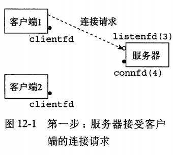

* 服务器正在监听一个监听描述符\(`描述符3`\)上的连接请求
* 服务器接收`客户端1`的连接请求
* 并返回一个已连接描述符\(`描述符4`\)。

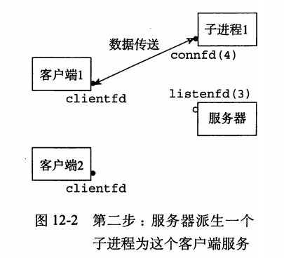

* 子进程获得服务器描述符表的完整拷贝\(`描述符3,4`\)
* 子进程关闭它的拷贝中的`监听描述符3`
* 服务器关闭描述符表中的`描述符4`

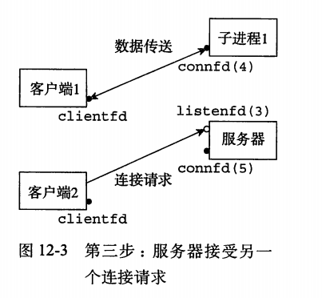

* 之后新的客户端又类似之前两个步骤。

### 基于进程的并发服务器

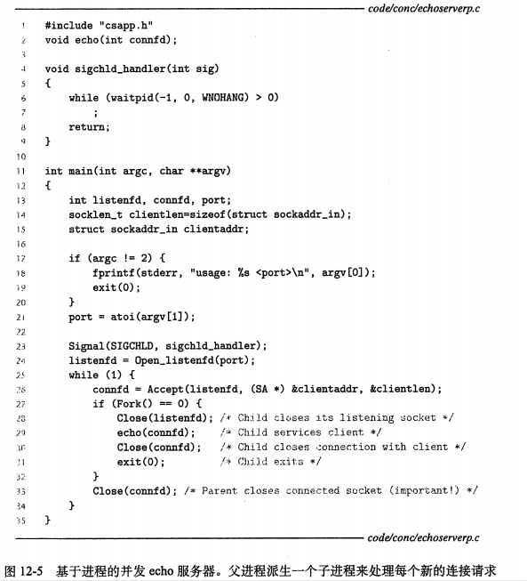

* 用`Signal(SIGCHLD,sigchld_handler)`回收僵死进程。
  * 具体细节见`8.5.7`
* `28`行，`33`行 父子进程各自关闭他们不需要的拷贝。
* 因为文件表项的引用计数，直到父进程关闭它的描述符，才算结束一次`连接`

### 关于进程的优劣

对于在父，子进程间共享状态信息，进程有一个非常清晰的`模型`。

* 共享**文件表**，但是不共享**用户地址空间**。
* `进程`拥有独立的**虚拟地址空间**即是 **优点**，也是 **缺点**。
  * `优点`:一个`进程`不可能不小心覆盖另一个进程的虚拟存储空间。
    * 消除许多令人迷惑的错误。
  * `缺点`:**独立的地址空间**使得进程间共享信息也很困难。
    * 必须使用显式的`IPC`\(进程间通信\)机制。
    * 往往还比较`慢`
      * **进程控制**和`IPC`的开销都很大。

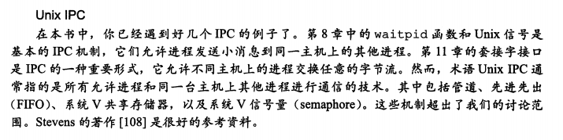

## 基于I/O多路复用的并发编程\(暂时跳过\)

假设要编写一个`echo服务器`。

* `服务器`既能响应`客户端`的请求
* 也能对用户从**标准输入输出**的交互命令做出反应\(如`exit`\).

因此，`服务器`必须要响应两个相互独立的`I/O`事件

* 网络客户端发起连接
* 用户在键盘键入命令行。

无论先等待那个事件都不是理想的，解决办法之一是就是使用`I/O多路复用技术`。

* 基本的思路
  * 使用`select`函数，要求内核挂起进程，只有一个或多个`I/O`事件发生后，才将控制返回给应用程序。

## 基于线程的并发编程

`线程(thread)` 就是运行在进程上下文中的逻辑流。

* 线程由`内核`调度。
* 每个线程都有它自己的`线程上下文(thread context)`.
  * 包括一个唯一的整数`线程ID(Thread ID,TID)`.
  * 栈和栈指针
  * 程序计数器
  * 通用目的寄存器和条件码
* 所有运行在该进程里的`线程`共享该进程的整个虚拟地址空间。
  * **共享** 包括代码，数据，堆，共享库和打开的文件。

### 线程执行模型

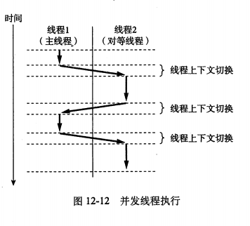

* 每个进程开始生命周期时都是单一线程，这个线程称为`主线程(main thread)`。
  * 某时刻，主线程创建一个`对等线程(peer thread)`。
    * 当主线程执行一个慢速系统调用，例如`read`或`sleep`
    * 或者被系统的`间隔计时器`中断。
    * 控制就会通过上下文切换传递到`对等线程`。
    * `对等线程`执行一段时间，将控制传递回主线程。
* 在某些方面，`线程`执行是不等同于进程的。
  * `线程`的上下文切换的开销比`进程`的小得多，快得多
  * `线程`不是按照严格的父子层次来组织。
    * 和一个进程相关的线程组成一个`线程池(pool)`。
      * `线程池`概念的主要影响是
      * 一个线程可以杀死它的任何对等线程，或等待任意`对等线程`终止。
      * 每个对等线程都能读写相同的共享数据。

### Posix 线程

`Posix线程` \(`Pthreads`\)是在C程序中处理线程的一个标准接口。

* 在大多数`Unix`系统可用
* 允许程序创建，杀死和回收线程，与对等线程安全共享数据，还可以通知对等线程系统状态的变化。

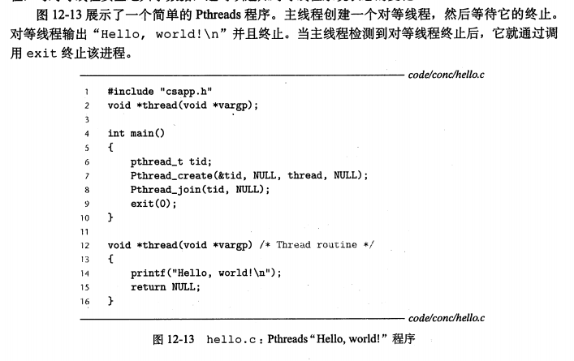

这是我们第一个线程化的代码，仔细解析。

* 线程的代码和本地数据被封装在一个`线程例程(thread routine)`中。
  * 如第`2`行代码所示:每个`线程例程`都以一个通用指针作为输入，并返回一个通用指针。
  * 如果想传递多个参数给`线程例程`
    * 你应该将参数放到一个结构中。
    * 并传递一个指向该结构的`指针`。
  * 如果想要`线程例程`返回多个参数。
    * 也可以返回一个指向结构的`指针`。
* `tid`存放对等线程的`线程ID`。
* 主线程调用`pthread_create`函数创建一个新的对等线程\(第`7`行\)。
  * 当对`pthread_create`的调用返回时，主线程和新创建的对等线程同时运行。
* 通过调用`pthread_join`,主线程等待`对等线程`的终止。
* `对等线程`输出`Hello,world`。
* `主线程`终止。

### 创建线程

线程通过调用`pthread_create`函数来创建其他线程。

```c
#include<phread.h>
typedef void *(func)(void *);

 int pthread_create( 
            pthread_t* pthread,             // 线程ID = 无符号长整型  pthread_t
            const pthread_attr_t* attr,     // 线程属性 ,NULL
            void* (*func)(void*),  // 线程处理函数
            void* arg                       // 线程处理函数参数
            );
    参数:
        thread:  传出参数, 线程创建成功之后,会被设置一个合适的值
        attr  :  默认传NULL,也可以传递进程分离参数 ,但是需要自己定义一个,然后使用函数初始化在传递过来.
        func :  子线程的处理函数, 也就是线程要开始执行的函数.
        arg  :  回调函数的参数 (小心地址传递和值传递,有必要的话 可以上锁).
    返回值:
        成功返回0 ,失败返回错误号.(这是进程独有的错误号,不能和其他标准库的混为一谈)
    范例: 
        void* myfunc(void* no){  
            printf("当前线程的 线程ID %ld \n, 传入参数 %d \n", pthread_self(), *a);
        /*自定义回调函数, 这里的内容省略 */ 
        }

        pthread_t pthid;
        int* a = 10;
        int ret = pthread_create(&pthid, NULL, myfunc, (void*)a);
        if(ret != 0 ){
            printf("error number %d , : %s",ret , strerror(ret));
        }


---------------
获得当前线程的ID号;   但是无法进行打印出来.
    函数原型:  pthread_t pthread_self(void);
        返回值 : 使用这个函数的返回值可以用来进行线程分离.
            pthread_detach(pthread_self());     //线程分离.

```

`pthread_create`函数创建一个新的线程。

* 带着一个输入变量`arg`，在新线程的上下文中运行`线程例程f`.
* 能用`attr`参数改变新创建线程的默认属性。
  * 改变这些属性超过我们的学习范围。
  * 我们总是用`NULL`作为`attr`的参数。
* `pthread_create`返回时，参数`tid`包含新创建线程的`ID`。
  * 通过调用`pthread_self`函数来获得它自己的线程`ID`。

### 终止线程

一个线程是以下列方式之一来`终止`的

* 当顶层的`线程例程`返回时，线程会`隐式地终止`。
* 通过调用`pthread_exit`函数，线程会`显示地终止`。
  * 如果主线程调用`pthread_exit`.
    * 等待所有其他对等线程终止，然后终止主线程和其他整个进程。
    * 返回值为`thread_return`
  * 原型如下

    ```c
    单个线程退出,而且不影响其他线程的函数   pthread_exit
    #include<pthread.h>
        函数原型: void pthread_exit(void *retval);
                    retval  参数: 可以NULL, 也可以给主线程返回一个信息. 但是主线程需要使用pthread_join来接受.
                                    但是需要注意返回值必须是 堆 或全局变量 ,需要保证数据还存在.
    
                结束一个线程, 但是无法释放自己的pcb .需要父线程来释放. 而且该线程退出后,它本身的栈区就会被销毁.
    
    ```
* 某个对等线程调用`Unix`的`exit`函数，函数终止进程和所有与该进程有关的`线程`。
* `对等线程`通过以当前线程ID为参数调用`pthread_cancle`函数来终止当前线程。
  * 原型

    ```c
    杀死(取消)线程 -- ptherad_cancel
    #include<pthread.h>
        函数原型: int pthread_cancel(pthread_t thread);
    
                    pthread 参数: 需要杀死的线程ID
            注意事项:
                在要杀死的子线程对应的处理函数的内部,必须做一次系统调用(printf,read,write,都会进行系统调用).
                如果实在不确定子线程有没有调用系统函数. 那么设置一个 ptherad_testcancel(); 这个函数也可以.
                ptherad_testcancel();这个函数没有任何意义,就是为了插入一个断点,让父线程可以杀掉这个子线程的一个位置.
    
    ```

### 回收已终止线程的资源

线程通过调用`pthread_join`函数等待其他进程终止

```c
回收子线程资源 阻塞等待线程退出, 获取线程退出状态(如果是线程分离,那么就不能使用这个函数了) -- pthread_join
#include<pthread.h>
        函数原型: int pthread_join(pthread_t thread, void** retval);

                thread  参数: 要回收的子线程的线程id
                retval  参数: 读取线程退出的时候携带的状态信息. 
                                是一个传出参数.
                                和exit中的参数指向内存地址相同.
                返回值:  如果成功返回 0 ;
                        如果失败返回 返回错误编号, 需要使用 strerror 来读取.

            这个函数会阻塞主线程, 直到子线程结束.

                范例:  void* ptr;     // 用来存放退出线程所携带的信息
                       pthread_join(pthread,&ptr);   // 阻塞主线程,等待子线程退出 ,然后把信息写入 ptr

```

* `pthread_join`函数会阻塞，知道线程`tid`终止，将线程返回的\(`void *`\)指针赋值给`thread_return`所指向的位置，然后回收已终止线程占用的存储器资源。
* `pthread_join`不像`wait`函数一样等待任意一个线程的结束。
  * 使得用不那么直观的方式，检测一个进程的终止。
  * `Stevens`在书中指出这是一个设计错误。

### 线程分离

在任何一个时间点上，线程是`可结合的(joinable)`或者 是分离的`(detached)`。

* 一个`可结合的线程`能够被其他线程收回其资源或者杀死。
  * 在被其他线程回收之前，它的存储器资源是没有被释放的。
* 一个`分离的线程`是不能被其他线程收回其资源或者杀死。
  * 系统自动释放资源。

`pthread_detach`函数分离可结合线程`tid`。

```c

线程分离 (一旦设置了线程分离, 那么它就会自动回收子线程的pcb) -- pthread_detach
#include<pthread.h>
        函数原型:  int ptherad_detach(pthread_t pthread);

                pthread 参数 : 需要分离的线程ID

        分离之后,子线程会自己回收本身的pcb, 不需要父进程的参与回收.

    直接设置线程分离的例子:
        pthread_t pthid;
        pthread_create(pthid, NULL, myfunc, NULL);
        ptherad_detach(pthid);
        // 完成 线程分离了 , 不需要设置属性
```

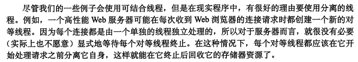

###  初始化线程

`pthread_once`函数允许你初始化与线程例程相关的状态。

```c
#include<pthread.h>

pthread_once_t once_control = PTHREAD_INIT;

int phread_once(phread_once_t *once_control,void (*init_routine)(void));


线程属性:  ( 这种设置 一般用在创建线程之前,然后使用这个设置去创建线程 )
    通过线程属性设置线程的分离:
        线程属性类型 : ptherad_attr_t attr;  // 这种设置的好处显而易见, 子线程可以独立释放pcb ,防止僵尸进程.

        线程属性操作函数:
            对线程属性变量的初始化
                int pthread_attr_init(pthread_attr_t* attr);

            设置线程分离属性
                int ptherad_attr_setdetachstate( pthread_attr_t* attr, int detachstate);
                    参数:
                        attr :  线程属性
                        detachstate : PTHREAD_CREATE_DETACHED (分离)
                                      PTHREAD_CREATE_JOJINABLE (非分离)

            释放线程资源函数:
                int pthread_attr_destroy(pthread_attr_t* attr);
                    // 上面的attr 使用完后需要用这个回收


    范例:
    // 创建一个子线程
    pthread_t pthid;
    
    pthread_attr_t attr;        // 声明一个线程属性变量
    pthread_attr_init(&attr);     // 将这个变量初始化
    pthread_attr_setdetachstate(&attr, PTHREAD_CREATE_DETACHED);  // 将属性设置为 分离

    int ret = pthread_create(&pthid, &attr, myfunc, NULL); // 创建线程,并将属性传入,分离

    if( ret != 0){                                  // 判断是否创建成功
        printf("error number: %d\n",ret);
        printf("%s\n",strerror(ret));
        exit(1);
    }
    
    printf("parent thread id: %ld\n",pthread_self());   // 输出当前线程的id 号

    sleep(2);
    pthread_attr_destroy(&attr);        // 释放线程属性变量占用的空间.


```

* `once_control`变量是一个全局或者静态变量，总是被初始化为`PTHREAD_ONCE_INIT`.
* 当你第一次用参数`once_control`调用`pthread_once`时，它调用`init_routine`。
  * 这是一个没有输入参数，也不返回什么的函数。
* 第二次，第三次以参数`once_control`调用`pthread_once`时，啥事也不发生。
  * 意思时仅仅第一次调用时有效果。
* 当你需要动态初始化多个线程共享的全局变量时，`pthread_once`函数是很有用的。

### 一个基于线程的并发服务器

```c
#include "csapp.h"

void *thread(void *vargp); /* Thread routine prototype */

/* Global shared variables */
/* $begin goodcntsemdef */
    volatile long cnt = 0; /* Counter */
    sem_t mutex;           /* Semaphore that protects counter */
/* $end goodcntsemdef */

int main(int argc, char **argv) 
{
    int niters;
    pthread_t tid1, tid2;

    /* Check input argument */
    if (argc != 2) {
	printf("usage: %s <niters>\n", argv[0]);
	exit(0);
    }
    niters = atoi(argv[1]);

    /* Create threads and wait for them to finish */
/* $begin goodcntseminit */
    Sem_init(&mutex, 0, 1);  /* mutex = 1 */
/* $end goodcntseminit */
    Pthread_create(&tid1, NULL, thread, &niters);
    Pthread_create(&tid2, NULL, thread, &niters);
    Pthread_join(tid1, NULL);
    Pthread_join(tid2, NULL);

    /* Check result */
    if (cnt != (2 * niters))
	printf("BOOM! cnt=%ld\n", cnt);
    else
	printf("OK cnt=%ld\n", cnt);
    exit(0);
}

/* Thread routine */
void *thread(void *vargp) 
{
    int i, niters = *((int *)vargp);

/* $begin goodcntthread */
    for (i = 0; i < niters; i++) {
	P(&mutex);
	cnt++;
	V(&mutex);
    }
/* $end goodcntthread */
    return NULL;
}
/* $end goodcnt */
```

* 注意使用`malloc`动态给一个`connfdp`，否则可能两个线程引用同一个`connfdp`的地址。
  * 这叫做`竞争`
* 为在`线程例程`中避免存储器泄露，使用`分离线程`。
* 还要注意释放在`主线程`中`malloc`的变量。

## 多线程程序中的共享变量

为了解一个C程序中的一个变量是否共享，有一些基本的问题要解答

* 线程的`基础存储器模型`是什么?
* 根据这个模型，`变量实例`是如何映射到存储器的?
* 有多少线程引用这些实例?

为了使共享讨论具体化，使用下图的程序作为示例。

```c
/* $begin sharing */
#include "csapp.h"
#define N 2
void *thread(void *vargp);

char **ptr;  /* Global variable */ //line:conc:sharing:ptrdec

int main() 
{
    int i;  
    pthread_t tid;
    char *msgs[N] = {
	"Hello from foo",  
	"Hello from bar"   
    };

    ptr = msgs; 
    for (i = 0; i < N; i++)  
        Pthread_create(&tid, NULL, thread, (void *)i); 
    Pthread_exit(NULL); 
}

void *thread(void *vargp) 
{
    int myid = (int)vargp;
    static int cnt = 0; //line:conc:sharing:cntdec
    printf("[%d]: %s (cnt=%d)\n", myid, ptr[myid], ++cnt); //line:conc:sharing:stack
    return NULL;
}
/* $end sharing */

```

示例程序由一个创建两个`对等线程`的主线程组成。主线程传递一个唯一的`ID`给每个对等线程，每个对等线程利用这个`ID`输出一个个性化的信息，以及调用该`线程例程`的总次数。

### 线程存储器模型

线程化的C程序中的变量根据它们的存储类型被映射到虚拟存储器:

* **全局变量**
  * `全局变量`是定义在函数之外的变量。
    * 在运行时,虚拟存储器中的`读/写区域`包含每个全局变量的一个实例。
    * 任何`线程`都可以引用。
    * 例如，第`5`行声明的`ptr`。
* **本地自动变量**
  * `本地自动变量`就是定义在函数内部但是没有`static`属性的变量。
    * 在运行时，每个线程的`栈`包含它自己的所有本地自动变量的实例。
* **本地静态变量**
  * `本地静态变量`是定义在函数内部有`static`属性的变量。
    * 和全局变量一样，存储在虚拟存储器的`读/写区域`。
    * 例如:第`25`行的`cnt`.

#### 12.4.3 共享变量 <a id="&#x5171;&#x4EAB;&#x53D8;&#x91CF;"></a>

我们说一个变量`v`是`共享`的，当期仅当它的一个实例被一个以上的`线程`引用。

例如:

* `cnt` 是共享的
* `myid` 不是共享的
* 认识到`msgs`这种本地自动变量也能被共享是很重要的。

## 用信号量同步线程

**共享变量**十分方便，但是他们也引入了`同步错误(synchronization error)`的可能性。

考虑下面的程序。

```c
/* 
 * badcnt.c - An improperly synchronized counter program 
 */
/* $begin badcnt */
/* WARNING: This code is buggy! */
#include "csapp.h"

void *thread(void *vargp);  /* Thread routine prototype */

/* Global shared variable */
volatile long cnt = 0; /* Counter */

int main(int argc, char **argv) 
{
    long niters;
    pthread_t tid1, tid2;

    /* Check input argument */
    if (argc != 2) { 
	printf("usage: %s <niters>\n", argv[0]);
	exit(0);
    }
    niters = atoi(argv[1]);

    /* Create threads and wait for them to finish */
    Pthread_create(&tid1, NULL, thread, &niters);
    Pthread_create(&tid2, NULL, thread, &niters);
    Pthread_join(tid1, NULL);
    Pthread_join(tid2, NULL);

    /* Check result */
    if (cnt != (2 * niters))
	printf("BOOM! cnt=%ld\n", cnt);
    else
	printf("OK cnt=%ld\n", cnt);
    exit(0);
}

/* Thread routine */
void *thread(void *vargp) 
{
    long i, niters = *((long *)vargp);

    for (i = 0; i < niters; i++) //line:conc:badcnt:beginloop
	cnt++;                   //line:conc:badcnt:endloop

    return NULL;
}
/* $end badcnt */
```

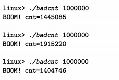

到底哪里出错了呢?这个错误十分`隐晦`，必须通过研究`计数器循环`时的**汇编代码**才能看出。

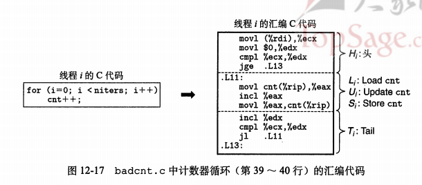

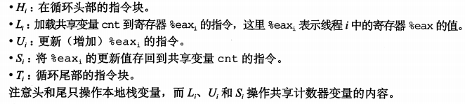

当`badcnt.c`中的两个对等线程在一个单处理器上`并发执行`，机器指令以某种顺序一个接一个地完成。同一个程序每次运行的顺序都可能不同，这些`顺序`中有一些将会产生正确结果，但是其他的不会。这就是`同步错误`

`关键点`: **一般而言，你没有办法预测操作系统是否将为你的线程选择一个正确的顺序**。

* 下图，就是`cnt`正确的顺序和错误的顺序\(正确结果`cnt=2`，错误结果`cnt=1`\)

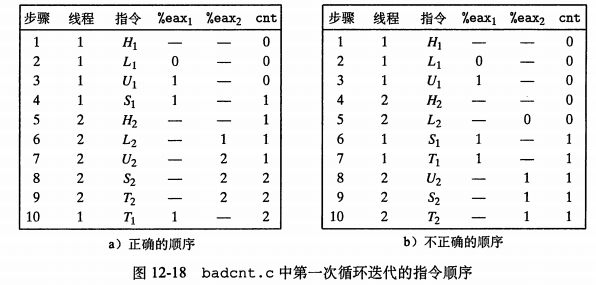

我们可以借助于一种叫做`进度图(progress graph)`的方法来阐明这些正确和不正确的指令顺序的概念。将在接下来介绍。

`进度图(process graph)` 将`n`个并发进程的执行模型化为一条`n`维笛卡尔空间的`轨迹线`。

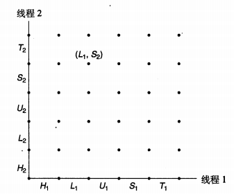

* 每条轴`k`对应于`k`的进度。
* 每个点`(I1，I2，I3，I4...,In)`代表线程`k(k=1,...,n)`已经完成到了`Ik`这条指令的状态。
* 图的原点对应于没有任何线程完成这一条指令的`初始状态`。

`进度图`将指令执行模型化为从一个状态到另一个状态的`转换(transition)`。

* `转换`指从一点到相邻一点的有向边。
  * `合法的转换`是向各个轴的正半轴走。

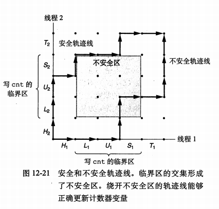

**临界区**

对于线程`i`，操作共享变量`cnt`内容的指令`(Li,Ui，Si)`构成了一个\(关于共享变量`cnt`的\)`临界区(critical section)`。\(必须确保指令要这样执行\)

* 这个`临界区`不应该和其他线程的`临界区`交替执行。\(这一段的指令不能交叉\)。
* 我们要确保每个线程在执行它的临界区中的指令时，拥有对共享变量的`互斥的访问(mutually exclusive access)`。
  * 通常这种现象叫做`互斥(mutual exclusion)`。

**不安全区**

在进程图中，两个临界区的交集形式称为`不安全区(unsafe region)`。

* 不安全区边缘的不算不安全区的一部分。

**安全轨迹线，不安全轨迹线**

* 绕过不安全区的轨迹线叫做`安全轨迹线`。
  * 能正确更新计数器
* 接触到不安全的轨迹线叫做`不安全轨迹线`。

我们必须以某种方式`同步线程`，使它们总是有一条`安全轨迹线`

* 一个经典的方法，就是基于信号量的思想。

### 信号量

`Edsger Dijksta`，并发编程领域的先锋任务，提出了一种经典的解决`同步不同执行线程问题`的方法

这种方法是基于一种叫做`信号量(semaphore)`的特殊类型变量。

* 信号量`s`是具有非负整数值的全局变量。
* 只能由两种特殊的操作来处理，这两种操作称为`P`和`V`
  * `P(s),Proberen，测试`
    * 如果`s`是非零的，那么`P操作`将`s`减1，并且立即返回。
    * 如果`s`为零，那么就挂起这个线程，直到`s`变为非零。
      * 而一个`V`操作会重启这个线程。
      * 在重启之后，`P操作`将`s`减1，并将控制返回给调用者。
  * `V(s),Verhogen，增加`
    * `V操作`将`s`加1.
    * 如果有任何线程阻塞在`P操作`等待`s`变成非零。
      * 那么`V操作`**随机**会重启这些线程中的一个。
      * 然后将`s`减去1，完成它的`P操作`。
  * **重点**，`P操作`和`V操作`都是不可分割的，也就是自身确保了是一个带有安全轨迹的操作。\(所以又叫`原语`\)
    * 对比，上文中的`cnt++`的操作。
    * 例如，`加1`这个操作中，加载，加一，存储信号量过程是不可分割的。

`P`和`V`的定义确保了一个正在运行的程序绝不可能进入这样一种状态，也就是不可能有负值。  
这个属性叫做`信号量不变性(semaphore invariant)`，为控制并发程序的轨迹线提供了强有力的工具。

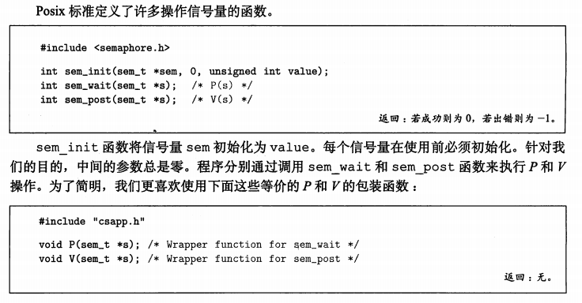

### 使用信号量来实现互斥

`信号量`提供了一种很方便的方法来确保对共享变量的互斥访问。

基本的思想是

* 将每个`共享变量`\(或一组相关的共享变量\) 与一个`信号量s(初始为`\)\`联系起来。
* 然后用`P(s)`和`V(s)`操作相应的临界区包围起来。

以这种方式保护共享变量的信号量叫做`二元信号量(binary semaphore)`

* 因为它的值总是0或者1。

以提供互斥为目的的`二元信号量`常常也称为`互斥锁(mutex)`。

* 在一个互斥锁上执行`P操作`叫做`互斥锁加锁`。
* 在一个互斥锁上执行`V操作`叫做`互斥锁解锁`。
* 对一个互斥锁加了锁还没有解锁的**线程**称为`占用这个互斥锁`。

一个被用作一组可用资源的计数器的信号量称为`计数信号量`。

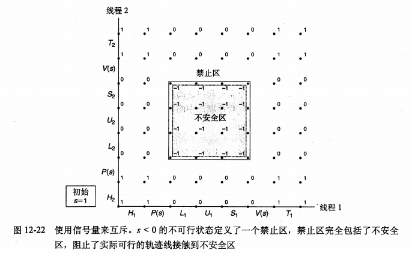

关键思想:

* `P操作`和`V操作`的结合创建了一组状态，叫做`禁止区(forbidden regin)`，其中`s<0`
  * 因为`信号量的不变形`，不可能有轨迹线进入这个区域
  * 而且`禁止区`包含了`不安全区`的任何部分。
    * 使得，每条可行的轨迹线都是安全的。

**代码上的实现**

正确实现上文中的`cnt`的线程同步。

* 第一步:声明一个信号量 `mutex`

  ```c
    volatile int cnt = 0 ; 
    sem_t mutex;
  ```

* 第二步:主线程中初始化

  ```c
    Sem_init(&mutex,0,1);
  ```

* 第三步，在线程例程中对共享变量`cnt`的更新包围`P`和`V`操作，从而保护了它们。

  ```c
    for( i = 0 ;i < niters ;i++) {
        P(&mutex);
        cnt++;
        V(&mutex);
    }
  ```

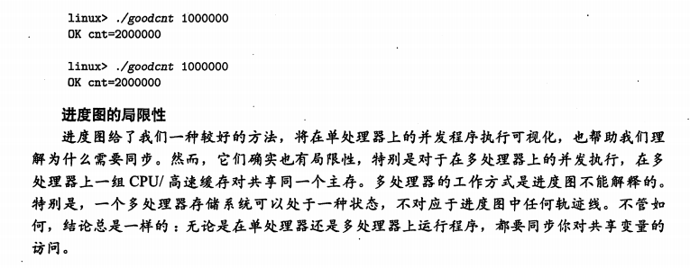

### 利用信号量来调度共享资源

除了提供`互斥`外，信号量的另一个重要作用是**调度对共享资源的访问**。

* 在这种场景中，一个线程用信号量操作来通知另一个线程，程序状态中的某个条件为真了。
* 两个经典而有用的例子。
  * 生产者 - 消费者 问题
  * 读者 - 写者 问题

**1.生产者和消费者**

图给出了生产者消费者问题

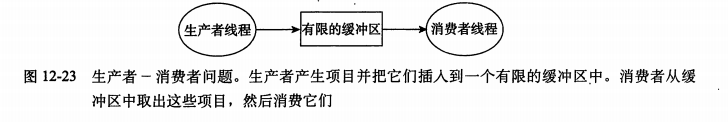

* `生产者线程`反复地生成新的`项目`，并把它们插入到缓冲区中。
* `消费者线程`不断地从缓冲区取出这些`项目`，然后消费使用它们。
* 也可能有多个的变种。

因为插入和取出项目都涉及更新共享变量

* 所以我们必须保证对缓冲区的访问是`互斥的`
* 还需要调度对`缓冲区`的访问。
  * 如果缓冲区是满的，那么生产者必须等待直到有一个槽位变为可用。
  * 如果缓冲区是空的，那么消费者必须等待知道有一个项目变为可用。

我们将开发一个简单的包，叫做`SBUF`，用来构造生产者-消费者程序。

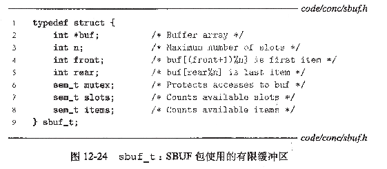

`SBUF`操作类型为`sbuf_t`的有限缓冲区。

* `项目`存放在一个动态分配的`n`项整数数组\(`buf`\)中。
* `front`和`rear`索引值记录该队列的第一项和最后一项。
* 三个信号量同步对缓冲区的访问。
  * `mutex`信号量提供互斥的缓冲区访问
  * `slots`和`items`信号量分别记录空槽位和可用项目的数量。

以下给出`SBUF`函数的实现:

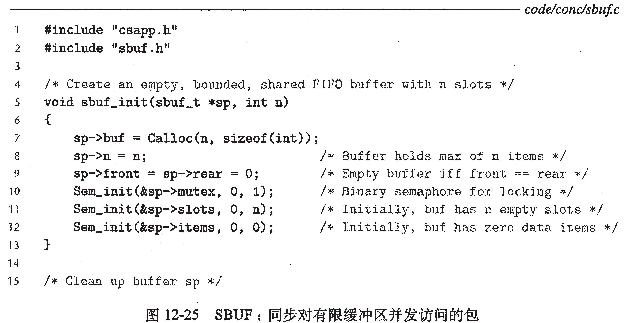

* `sbuf_init`函数进行初始。
  * 为缓冲区分配堆存储器
  * 设置`front`和`rear`表示一个空的缓冲区。
  * 并为3个信号量赋初值。

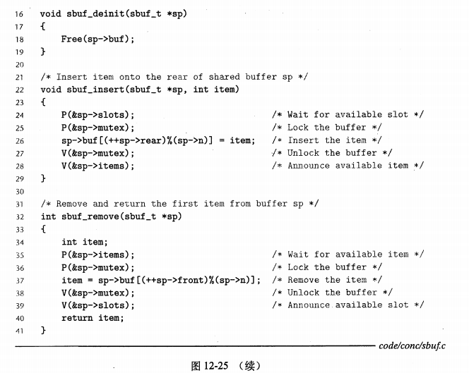

* `sbuf_deinit`函数是当应用程序使用完缓冲区时，释放缓冲区存储。
* `sbuf_insert`
  * 等待一个可用的槽位
  * 对互斥锁加锁，添加项目，对互斥锁解锁
  * 然后宣布有一个新项目可用。
* `sbuf_remove`
  * 等待一个可用的项目
  * 对互斥锁加锁，取出项目，对互斥锁解锁
  * 然后宣布有一个新槽位可用。

**2.读者-写者问题**

`读者-写着`问题是互斥问题的一个概括。

* 一组并发的线程要访问同一个数据对象。
  * 修改对象的线程叫做`写者`
  * 只读对象的线程叫做`读者`
* `写者`必须拥有对对象的独占访问。
* `读者`可以和无限多个其他读者共享对象。
* 一般来说有无数个并发的读者和写者。

`读者-写者`问题有几个变种，都是基于读者和写者的**优先级**

* **第一类读者-写者问题**
  * `读者`优先，要求**不要让读者等待**，除非已经把一个使用权限赋予了一个`写者`。
  * 换句话说，`读者`不会因为有一个`写者`在等待而等待。
* **第二类读者-写者问题**\(?\)
  * `写者`优先，要求一但一个写者准备好可以写，它就会尽可能地完成它的写操作。
  * 同第一类不同，在一个写者到达后的读者必须等待，即使这个写者也是在等待。

给出第一类读者-写者问题答案。

* 这个的优先级很弱，因为一个离开临界区的写者可能重启一个在等待的写者\(随机重启\)
  * 很有可能一群写者使得一个读者饥饿

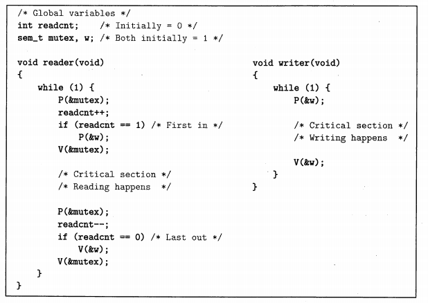

* 信号量`w`控制对访问共享对象的临街区的访问。
  * 读者
    * `w`只对第一个读者上锁
    * `w`对最后一个走的读者解锁
  * 写者
    * 写者只要进入临界区就对`w`上锁
    * 写者只要离开临界区就对`w`解锁
* 信号量`mutex`保护对共享变量`readcnt`的访问。
  * `readcnt`统计当前临界区的读者数量。

所有`读者-写者`答案都有可能导致`饥饿`

* 饥饿就是一个线程无限期地阻塞，无法进展。

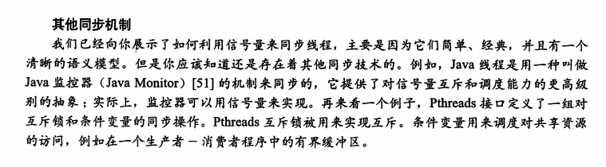

### 基于预线程化的并发服务器

为每个新的客户端创建新的线程，有不少的代价。

一个基于`预线程化`的服务器利用生产者-消费者模型构造一个更高效率的方式。

* 生产者: 主线程
* 消费者: 对等线程

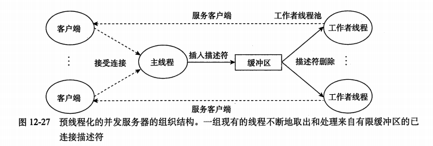

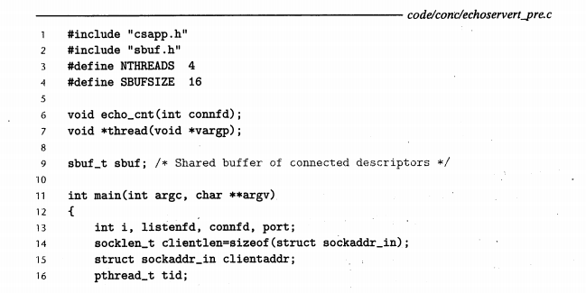

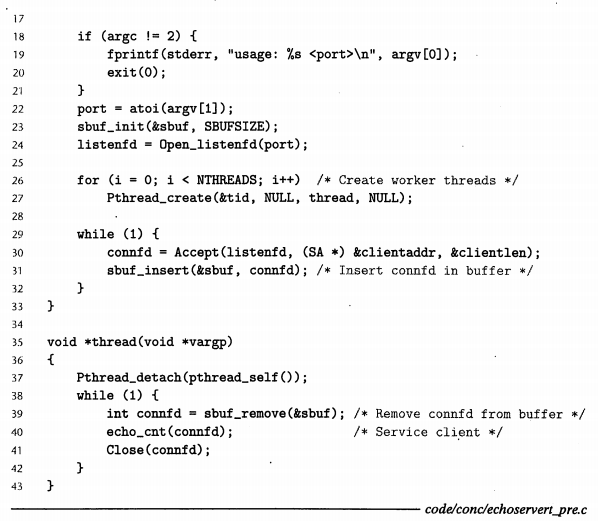

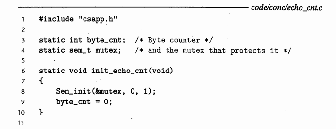

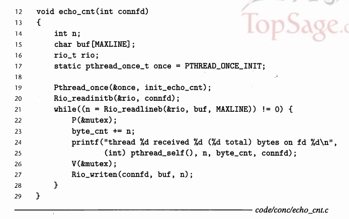

## 使用线程提高并行性\(暂略\)

主要用于多核CPU的算法。

比如:利用并行来完成n路递归

## 其他并发问题

`互斥`和`生产者-消费者同步`的技术，只是**并发问题**的冰山一角。

`同步问题`从根本来说是很难的问题。

这章我们以`线程`为例讨论。

* 但是要知道`同步问题`在任何`并发流`操作共享资源时都会出现。
  * 比如之前学`信号`时，回收进程时的`竞争`。

### 线程安全

一个函数被称为`线程安全的(thread-safe)`，当且仅当被多个并发线程反复地调用时，它会一直产生正确的结果。否则就是`线程不安全的(thread-unsafe)`

我们能够定义出`四个`\(不相交\)线程不安全函数类:

* 第 1 类 : **不保护共享变量的函数。**
  
  * 解决方案，利用`P，V`这样的同步操作来保护共享的变量
* 第 2 类 : **保持跨越多个调用状态的函数**
  * 一个`伪随机数生成器`是这类线程不安全的例子。 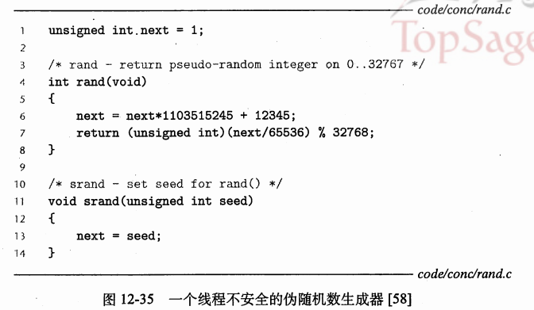
  * 因为产生的结果依赖于上一个`next`的值。
    * 在单线程中，用同一个`seed`无论运行多少次，都是同样的结果。
    * 多线程中，这种情况就不会出现了，所以是`线程不安全`的
  * 解决方案: **重写**
    * 使得它不能依赖`static`，而是依靠调用者在参数中传递状态信息。
    * 缺点: 需要在曾经成千上百个不同的调用位置，修改。十分麻烦。
* 第 3 类 :**返回指向静态变量的指针的函数**\( **有点类似第一类** \)
  * **危害**:我们在并发线程中调用这些函数，可能发生灾难。
    
    * 因为一个正在被一个线程使用的变量，可能偷偷被另一个线程悄悄覆盖。
  * 解放方案
    * **重写函数**:让**调用者**传递存放的结果的`指针`。
    * **加锁-拷贝技术**:
      * 在一个调用位置，互斥锁加锁。
      * 调用线程不安全函数，将函数返回的结构拷贝到一个私有的存储器。
      * 然后互斥锁，解锁。
  * 用上面的原理写一个`线程不安全函数`的包装函数来实现线程安全。
  
    * 以ctime为例子
  
      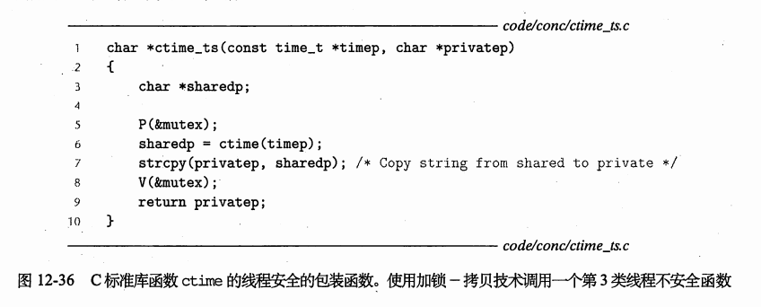
* 第 4 类 : **调用线程不安全函数的函数**。
  * 如果函数`f`调用线程不安全函数`g`。那么`f`可能不安全。
    * 如果`g`是第二类，那么`f`一定不安全，也没有办法去修正，只能改变`g`.
    * 如果`g`是第一，三类，可以用**加锁-拷贝技术**来解决。

### 可重入性

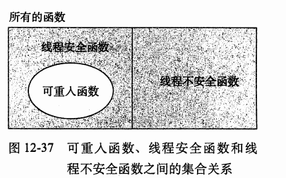

有一类重要的`线程安全函数`，叫做`可重入函数(reentrant function)`

* 其特点在于它们有这样一种属性。
  * 当它们被多个线程调用时，**不会引用**任何`共享数据`。
* 被分为两类
  * **显示可重入**
    * 参数都是**值传递**
    * 变量都是**本地自动栈变量**
  * **隐式可重入**
    * 参数可以有指针
      * 但是不允许调用者传入指向共享数据的指针。
    * 是否可重入，同时取决于`调用者`，和`被调用者`。
* `可重入函数`比较高效是因为不需要同步操作。
* 认识到可重入性有时即是`调用者`也是`被调用者`的属性。
  * 并不是`被调用者`的单独属性。

### 在线程化的程序中使用已存在的库函数

大多数`Unix`函数，包括大部分定义在标准C库的函数\(`malloc`,`free`,`realloc`,`printf`和`scanf`\)都是**线程安全**的。

**部分线程不安全**

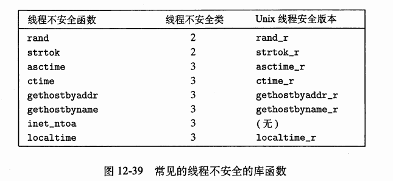

* `asctime`,`ctime`,`localtime`函数是在不同时间和数据格式相互来回转换时经常使用的函数。
* `gethostbyname`,`gethostbyaddr`,`inet_ntoa`函数是经常用的网络编程函数。
* `strtok`函数是一个过时了的同来分析字符串的函数。

`Unix`系统提供大多数线程不安全函数的可重入版本。

* 可重入的版本总是以 `_r`后缀结尾。
* 例，`gethostbyname_r`。

### 竞争

当一个程序的正确性依赖于一个线程要在另一个线程到达`y`点之前到达它的控制流中的`x`点，就会发生`竞争`。

* 通常，`竞争`发生的理由是因为程序员假定某种特殊的轨迹线穿过执行状态空间。

例子:

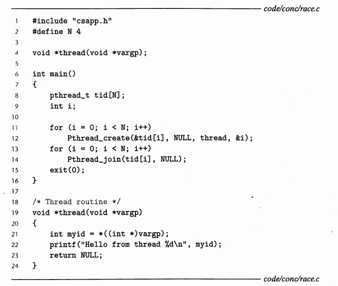

程序十分简单。

主线程创建了四个`对等线程`，并传递一个指向循环变量`i`的指针作为线程的`ID`。并输出。

* 一般而言，循环变量`i`一定是四个不同的。所以会想当然觉得会输出四个不同的`ID`。

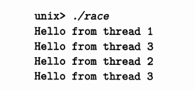

* 但是从结果来看，显然是错误的，有两个3，为什么?
  * 因为我们想当然的觉得`对等线程`给`myid`赋值结束后，`i`才会自增。
  * 竞争来源于 主线程中`i++`，和对等线程`myid=*((int *)vargp)`的 `竞争`。

解决方案:用一个临时地址保存`i`

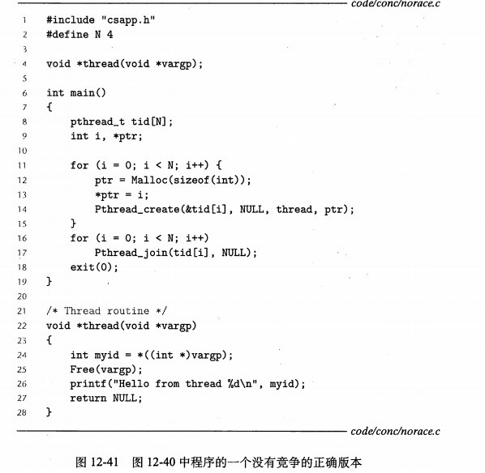

### 死锁

`信号量`引入了一种潜在的令人厌恶的运行时错误，叫做死锁 \(`deadlock`\)。

* 指的是一组线程被阻塞，等待一个永远不为真的条件。

`进度图`对于理解死锁是一个无价的工具。

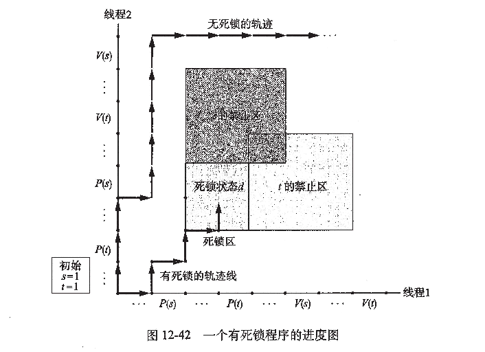

* 死锁的`区域d`是一个**只能进**，**不能出**的区域。
  * 位置是合法的，并不是`禁止区`，能进去。
  * 但是会发现**无论**向上，还是右，都只剩下`禁止区`了。
* 如果禁止区不重叠，一定不会发生`死锁`。
  * 否则，**可能发生**`死锁`。
* 死锁是一个相当困难的问题，因为它总是不可预测的。
  * 幸运的话，会绕开`死锁`区域。
  * 错误还不会重复，轨迹不同。

**特殊解**

使用二元信号量来实现互斥，可以应用一下有效的规则。

`互斥锁加锁顺序规则`:**如果对于程序中每对互斥锁`(s,t)`,每个占用`s`和`t`的线程都按照相同的顺序对它们加锁，那么这个程序就是无死锁的。**

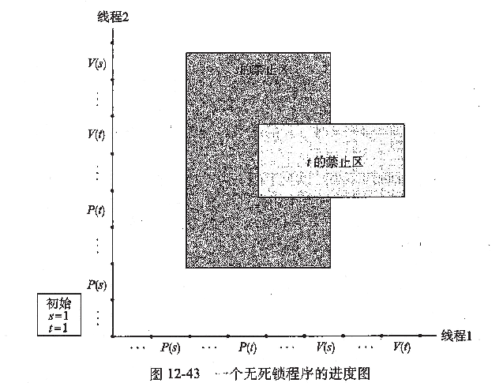

